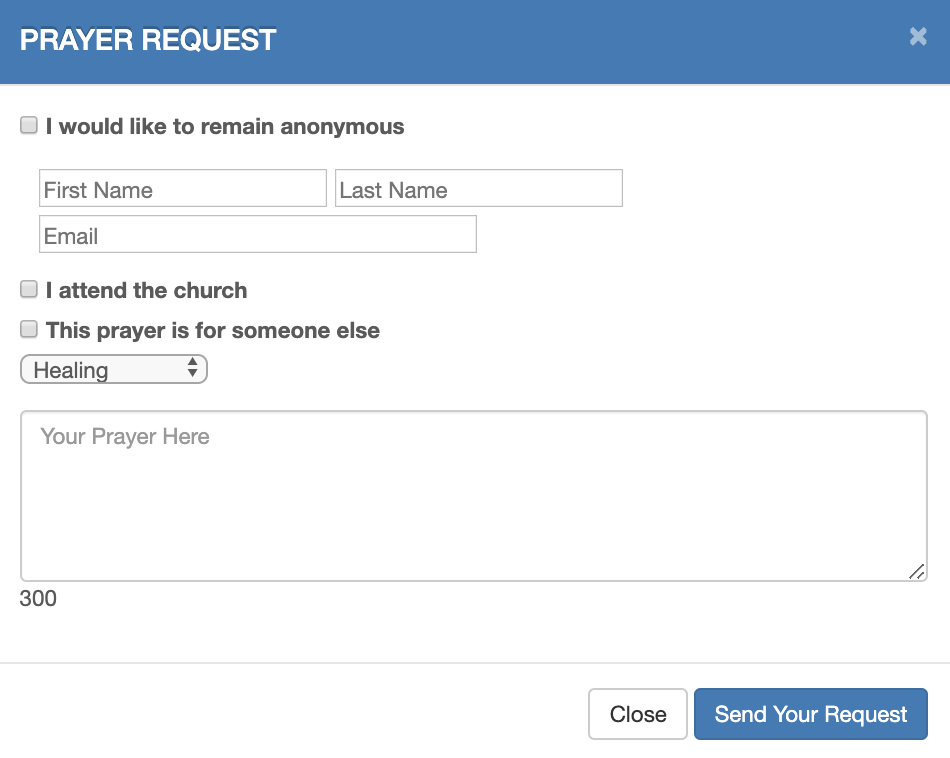

# prayer_requests
\\
On the front-end, it's an online prayer request form that anyone from the community can use to let a church know that they need prayer for something. 
The back-end has a dashboard seen by the church leadership that categorizes prayers based on date and type to give them an idea of what the community is dealing with 
at any given time. 

## Motivation
As churches grow larger and have a greater presence online, it can be harder to keep up constant communication with the people that they serve. This app is aimed at 
helping to close that gap by allowing people to send prayer requests directly to the church administration.

### 